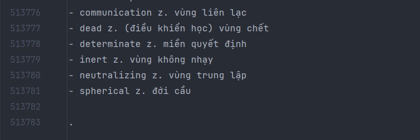

## Đây là đoạn code dùng để convert dữ liệu từ file từ điển anh-việt có dạng txt thành các object để chuẩn bị đưa vào cơ sở dữ liệu quan hệ
### File từ điển https://github.com/yenthanh132/avdict-database-sqlite-converter/blob/master/vietanh.txt
### Trước khi sử dụng, bạn hãy kéo xuống cuối file txt và thêm vào enter và dấu chấm như hình sau:

## Phần code mình dùng để đưa dữ liệu vào database sqlite, cũng như database sqlite: https://github.com/thiennguyen9804/se121.p11-sqlite-database-seeding

## This is a piece of code for mapping data in a txt English-Vietnamese dictionary-file to object to be added to a relational database

### The txt file itself: https://github.com/yenthanh132/avdict-database-sqlite-converter/blob/master/vietanh.txt
### Before running the above code, make sure to scroll down to the end of the txt file and add 1 enter and 1 dot as below:

## The code I use to add said objects to the sqlite database and the database in and of itself: https://github.com/thiennguyen9804/se121.p11-sqlite-database-seeding